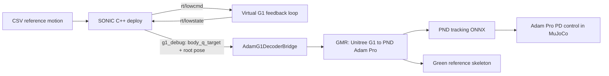

# GR00T Whole-Body Control: rgz_sonic 使用说明

本文档是 `rgz_sonic` 分支的补充说明，重点描述当前仓库中的两条 MuJoCo
sim2sim 链路：

- NVIDIA 原生 Unitree G1 + GEAR-SONIC 链路。
- 本分支新增的 G1 reference -> GMR retargeting -> PND Adam Pro tracking 链路。

根目录原有的 [`README.md`](README.md) 保持不变，仍是上游项目的完整介绍、训练说明、
模型卡和官方文档入口。本文档记录本分支的运行环境、启动顺序、仓库结构和常见问题。

## 1. 分支功能概览

`rgz_sonic` 在上游 `NVlabs/GR00T-WholeBodyControl` 的基础上增加了：

- `adam_pro` MuJoCo 机器人类型和 43 个执行器的 PD 控制。
- Adam locomotion ONNX 和 PND motion-tracking ONNX 适配器。
- Unitree G1 29-DoF reference 到 PND Adam Pro 的在线 GMR 重定向。
- 从 SONIC `g1_debug` ZMQ 输出读取真实当前参考帧。
- 参考流超时、重连、策略历史和 IK 缓存重置处理。
- MuJoCo 中的绿色 PND 参考骨架，可在运行时显示或隐藏。

当前 tracking 数据链路如下：



`rt/lowcmd` 只用于维持虚拟 G1 闭环，不再作为 PND 参考动作。PND reference
来自 SONIC 当前 motion frame 的 `body_q_target`、`base_trans_target` 和
`base_quat_target`。

## 2. 运行环境

推荐环境：

- Ubuntu 22.04 x86_64。
- Python 3.10。
- NVIDIA GPU、CUDA 和 TensorRT，用于 `gear_sonic_deploy` 的 C++ 推理。
- Git LFS，用于仓库中的模型和大文件。
- MuJoCo、Unitree SDK2 Python、ONNX Runtime。
- 支持 `unitree_g1 -> pnd_adam_pro` 的 GMR 本地仓库。
- PND tracking ONNX 和对应的 HumanoidVLA Adam FK XML。

首次获取分支时执行：

```bash
git clone --branch rgz_sonic https://github.com/RRGGZZ/GR00T-WholeBodyControl.git
cd GR00T-WholeBodyControl
git lfs install
git lfs pull
```

下载上游 SONIC encoder、decoder 和 planner：

```bash
python download_from_hf.py
```

这会把默认模型放到 `gear_sonic_deploy/policy/release/` 和
`gear_sonic_deploy/planner/target_vel/V2/`。

### 2.1 创建 MuJoCo Python 环境

从仓库根目录执行：

```bash
bash install_scripts/install_mujoco_sim.sh
source .venv_sim/bin/activate
```

脚本会创建 `.venv_sim`，并安装 `gear_sonic[sim]` 和
`external_dependencies/unitree_sdk2_python`。

Adam/PND 模式还需要：

```bash
python -m pip install onnxruntime daqp
python -m pip install -e /path/to/robot_to_robot_retargeting
```

GMR 仓库必须包含以下 robot-to-robot 配置：

- source robot：`unitree_g1`。
- target robot：`pnd_adam_pro`。
- Python API：`general_motion_retargeting.RobotToRobotRetargeting`。

### 2.2 配置 PND 外部资源

配置文件位于：

```text
gear_sonic/utils/mujoco_sim/wbc_configs/adam_pro_sonic_model12.yaml
```

换机器后至少检查以下路径：

| 配置项 | 用途 | 当前默认值 |
|---|---|---|
| `ADAM_RETARGETING_ROOT` | GMR 仓库根目录 | `/home/r/Downloads/robot_to_robot_retargeting` |
| `ADAM_TRACKING_ONNX_PATH` | PND tracking transformer ONNX | `/home/r/Downloads/HumanoidVLA_MJ/example/python/adam_result/exported/model_126000.onnx` |
| `ADAM_TRACKING_FK_XML_PATH` | 训练时 Adam FK 模型 | `/home/r/Downloads/HumanoidVLA_MJ/example/python/humanoidverse/data/robots/adam_sp/adam_lite_Optim.xml` |
| `ADAM_POLICY_ONNX_PATH` | Adam locomotion ONNX | `/home/r/Downloads/HumanoidVLA_MJ/example/python/adam_result/exported/model_45000.onnx` |

Tracking 模式可以通过命令行临时覆盖 ONNX 路径：

```bash
python gear_sonic/scripts/run_sim_loop.py \
    --robot-type adam_pro \
    --adam-tracking-onnx-path /path/to/tracking_model.onnx
```

GMR 根目录和 FK XML 当前应直接在 YAML 中配置。

## 3. Adam Pro + SONIC + PND 启动步骤

需要两个终端。两边必须使用相同的 DDS domain 和本机 loopback 接口。

### 3.1 终端 1：启动 Adam Pro MuJoCo

从仓库根目录执行：

```bash
source .venv_sim/bin/activate
python gear_sonic/scripts/run_sim_loop.py --robot-type adam_pro
```

默认配置为：

- `ADAM_POLICY_TYPE=tracking`。
- SONIC reference 地址 `tcp://localhost:5557`。
- ZMQ topic `g1_debug`。
- reference 超时 `0.5 s`。
- 绿色 PND reference 骨架默认显示。

### 3.2 终端 2：启动 SONIC C++ deploy

```bash
cd gear_sonic_deploy
./deploy.sh --input-type keyboard sim
```

首次运行会配置并编译 C++ 工程。确认配置后输入 `Y`。默认
`--output-type all` 会启用 `g1_debug` ZMQ 输出，不需要额外增加输出参数。

等待终端出现 `Init Done` 后：

1. 在 deploy 终端按 `]`，进入 SONIC control。
2. 此时 SONIC 发布 frame 0，但 reference 不会自动向前播放。
3. Adam 终端应打印 `Adam PND reference connected; tracking source motion`。
4. 确认绿色骨架姿态正常后，在 deploy 终端按 `T` 播放动作。
5. 按 `R` 停止当前播放并回到当前 motion 的 frame 0。
6. 按 `N` / `P` 切换下一条 / 上一条 reference motion。
7. 按 `O` 停止控制并退出 deploy。

Adam 模式不需要在 MuJoCo 窗口按 `9`。`9` 是上游 G1 sim2sim 中释放
elastic band 的操作。

### 3.3 可视化按键

按键作用取决于当前焦点所在窗口：

| 窗口 | 按键 | 作用 |
|---|---|---|
| MuJoCo viewer | `P` | 显示 / 隐藏绿色 PND reference 骨架 |
| deploy 终端 | `]` | 启动 SONIC control，保持当前 reference frame |
| deploy 终端 | `T` | 播放当前 motion 到末尾 |
| deploy 终端 | `R` | 停止播放并重置到 frame 0 |
| deploy 终端 | `N` / `P` | 下一条 / 上一条 motion |
| deploy 终端 | `Q` / `E` | 调整 reference heading |
| deploy 终端 | `I` | 用当前姿态重新初始化 heading |
| deploy 终端 | `O` | 停止控制并退出 |

绿色骨架表示 G1 reference 经 GMR 重定向后、真正送入 PND tracking policy
的 Adam reference，不是 SONIC 的 `lowcmd` 控制输出。

### 3.4 断流与重连

- 在收到第一帧 `g1_debug` 前，PND policy 不会启动计时或消费伪参考。
- 超过 `ADAM_G1_REFERENCE_TIMEOUT` 没有新参考时，Adam 会清空 policy history
  和 GMR 缓存，并保持当时的关节目标。
- reference 恢复后，第一帧会立即重新执行 GMR，不会复用断流前的 IK 结果。
- “保持关节目标”不是动态平衡控制；如果在不稳定姿态断流，机器人仍可能因物理作用倒下。

## 4. 原生 Unitree G1 sim2sim

原生 G1 路径保持兼容。

终端 1：

```bash
source .venv_sim/bin/activate
python gear_sonic/scripts/run_sim_loop.py
```

终端 2：

```bash
cd gear_sonic_deploy
./deploy.sh --input-type keyboard sim
```

启动后在 deploy 终端按 `]`，在 MuJoCo 窗口按 `9` 释放机器人，再回到
deploy 终端按 `T` 播放 reference motion。详细控制说明见
[`docs/source/tutorials/keyboard.md`](docs/source/tutorials/keyboard.md)。

## 5. 常用 Adam 配置和命令行参数

| 参数 | 默认值 | 说明 |
|---|---:|---|
| `--robot-type` | `g1_29dof` | 使用 Adam 时传入 `adam_pro` |
| `--adam-policy-type` | `tracking` | `tracking` 或 `locomotion` |
| `--adam-retarget-max-iter` | `5` | G1 -> Adam IK 最大迭代次数 |
| `--adam-retarget-every-n` | `2` | 每 N 个 PND policy tick 执行一次 IK |
| `--adam-reference-zmq-host` | `localhost` | SONIC `g1_debug` 发布主机 |
| `--adam-reference-zmq-port` | `5557` | SONIC `g1_debug` 发布端口 |
| `--adam-reference-timeout` | `0.5` | reference 断流判定秒数 |
| `--adam-reference-visualization` | `true` | 是否启用绿色骨架 |
| `--adam-tracking-onnx-path` | YAML 值 | 覆盖 tracking ONNX |
| `--adam-policy-onnx-path` | YAML 值 | 覆盖 locomotion ONNX |

查看当前版本支持的完整参数：

```bash
source .venv_sim/bin/activate
python gear_sonic/scripts/run_sim_loop.py --help
```

## 6. 仓库结构

```text
GR00T-WholeBodyControl/
├── README.md                         # 上游 NVIDIA 项目说明，保留不变
├── README_RGZ_SONIC.md               # 本分支运行和结构说明
├── gear_sonic/                       # SONIC Python 训练、仿真、数据和工具
│   ├── config/                       # 训练、算法和实验配置
│   ├── data/                         # 机器人模型、人体和 motion 数据定义
│   ├── data_process/                 # motion 数据处理
│   ├── envs/                         # Isaac Lab / RL 环境
│   ├── scripts/                      # 仿真、训练、推理和 teleop 入口
│   ├── trl/                          # 强化学习训练模块
│   ├── tests/                        # Python 测试
│   └── utils/
│       ├── data_collection/          # ZMQ 状态和数据采集工具
│       ├── inference/                # VLA 推理工具
│       ├── motion_lib/               # motion library
│       ├── mujoco_sim/               # G1 / Adam MuJoCo 与策略桥接
│       ├── network/                  # 网卡与通信配置
│       └── teleop/                   # 远程操作工具
├── gear_sonic_deploy/                # C++ SONIC TensorRT 部署栈
│   ├── deploy.sh                     # 编译和启动入口
│   ├── policy/                       # encoder / decoder 模型和配置
│   ├── planner/                      # kinematic planner ONNX
│   ├── reference/                    # CSV reference motions
│   ├── src/                          # C++ policy、输入输出和 ZMQ 实现
│   ├── thirdparty/                   # C++ Unitree SDK 等依赖
│   ├── build/                        # CMake 构建目录，生成内容
│   └── target/                       # 编译产物，生成内容
├── decoupled_wbc/                    # GR00T N1.x decoupled WBC
├── motionbricks/                     # MotionBricks 模型、demo 和训练代码
├── docs/                             # Sphinx / GitHub Pages 文档源文件
├── external_dependencies/            # 仓库内 vendored Python/C++ 依赖
├── install_scripts/                  # sim、teleop、camera、inference 安装脚本
├── sample_data/                      # 示例 robot / SMPL / SOMA 数据
├── sonic_release/                    # SONIC PyTorch checkpoint 和配置
├── media/                            # README 和文档媒体资源
└── legal/                            # 第三方声明和许可证
```

### 6.1 Adam/PND 关键文件

| 文件 | 作用 |
|---|---|
| `gear_sonic/scripts/run_sim_loop.py` | MuJoCo sim 主入口和 robot type 选择 |
| `gear_sonic/utils/mujoco_sim/configs.py` | CLI 参数、YAML 加载和覆盖逻辑 |
| `gear_sonic/utils/mujoco_sim/simulator_factory.py` | simulator 创建和启动 |
| `gear_sonic/utils/mujoco_sim/base_sim.py` | Adam 模型、PD、reference 状态机和绿色骨架 |
| `gear_sonic/utils/mujoco_sim/unitree_sdk2py_bridge.py` | 虚拟 G1 DDS 闭环和 `g1_debug` ZMQ reference |
| `gear_sonic/utils/mujoco_sim/adam_onnx_policy.py` | locomotion、tracking ONNX、GMR 和 Adam FK |
| `gear_sonic/utils/mujoco_sim/wbc_configs/adam_pro_sonic_model12.yaml` | Adam 43-DoF、PND 和重定向配置 |
| `gear_sonic/data/robot_model/model_data/adam_pro/` | Adam Pro MuJoCo 模型和 mesh |
| `gear_sonic_deploy/src/g1/g1_deploy_onnx_ref/include/output_interface/` | SONIC `g1_debug` target 字段生成和发布 |

## 7. Reference 数据约定

SONIC CSV motion 的 29 个 G1 关节使用 IsaacLab 顺序存储。C++ deploy 在发布
`body_q_target` 时使用以下映射转换为 MuJoCo / GMR 顺序：

```text
[0, 3, 6, 9, 13, 17,
 1, 4, 7, 10, 14, 18,
 2, 5, 8, 11, 15, 19, 21, 23, 25, 27,
 12, 16, 20, 22, 24, 26, 28]
```

转换后的顺序是左腿 6、右腿 6、腰 3、左臂 7、右臂 7，与 GMR
`unitree_g1` source XML 一致。根四元数使用 MuJoCo `wxyz` 顺序。

## 8. 排障

### 8.1 按 `]` 后 Adam 没有连接

检查 deploy 是否使用 `--output-type all` 或 `--output-type zmq`，以及端口：

```bash
ss -ltnp | rg 5557
```

正常情况下 deploy 会打印：

```text
Binding to port: 5557 and topic: g1_debug
```

Adam 会打印：

```text
Adam PND reference connected; tracking source motion
```

### 8.2 按 `]` 后绿色骨架保持不动

这是预期行为。`]` 只进入 control 并发布当前 frame 0；按 `T` 才开始播放。

### 8.3 绿色骨架乱飞或左右腿错位

确认运行的是 `rgz_sonic` 分支，并完全重启 Python simulator 和 C++ deploy。
YAML 中应为：

```yaml
ADAM_G1_REFERENCE_SOURCE: "zmq"
ADAM_G1_REFERENCE_ZMQ_TOPIC: "g1_debug"
```

不要把 `rt/lowcmd.motor_cmd[].q` 当作 source reference；它是 SONIC 控制策略输出。

### 8.4 绿色骨架与 Adam mesh 有小幅肩部偏差

PND policy 的 reference marker 使用训练时 `adam_lite_Optim.xml` 做 FK，当前
MuJoCo scene 使用完整 Adam Pro 模型。两份模型腿、腰和头部坐标一致，肩部安装点
存在约 2 cm 的模型差异。这不等同于关节顺序错乱。

### 8.5 Reference 断流

停止 deploy 后约 0.5 秒会看到：

```text
Adam PND reference timed out; holding the current pose
```

检查 deploy 进程、5557 端口和 `g1_debug` topic。重启 deploy 后策略会清空旧
history 并从新 reference 首帧恢复。

### 8.6 `ChannelFactory create domain error`

先确认没有残留的 simulator 或 deploy：

```bash
ps -ef | rg "run_sim_loop|g1_deploy_onnx_ref"
```

同一 DDS domain 不应同时启动多套 sim。若只出现一次初始化提示、随后仍能看到
`Adam PND reference connected`，则继续观察实际链路；若持续失败，停止残留进程后重启。

## 9. 当前限制

- PND tracking ONNX 需要 10 个 future reference steps；当前在线适配器暂时把当前
  Adam reference frame 重复 10 次。骨架和当前帧是正确的，但动作预测质量仍可能
  低于使用真实未来轨迹的离线版本。
- GMR、HumanoidVLA FK XML 和 PND ONNX 当前是外部资源，没有包含在本仓库 Git 历史中。
- Reference 断流后的关节保持不是动态平衡器，非稳定姿态可能倒下。
- 所有真实机器人部署都应先在 MuJoCo 中验证，并保留独立急停手段。

## 10. 验证命令

修改 Python 代码后可执行：

```bash
source .venv_sim/bin/activate
python -m py_compile \
    gear_sonic/scripts/run_sim_loop.py \
    gear_sonic/utils/mujoco_sim/configs.py \
    gear_sonic/utils/mujoco_sim/simulator_factory.py \
    gear_sonic/utils/mujoco_sim/base_sim.py \
    gear_sonic/utils/mujoco_sim/unitree_sdk2py_bridge.py \
    gear_sonic/utils/mujoco_sim/adam_onnx_policy.py
git diff --check
```

上游训练、VLA、VR teleop、MotionBricks 和真实 G1 部署细节请继续参考
[`README.md`](README.md) 和 [`docs/`](docs/)。
